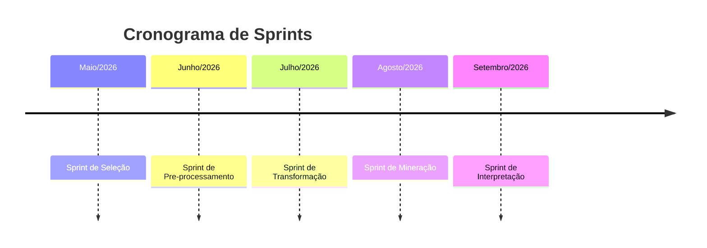
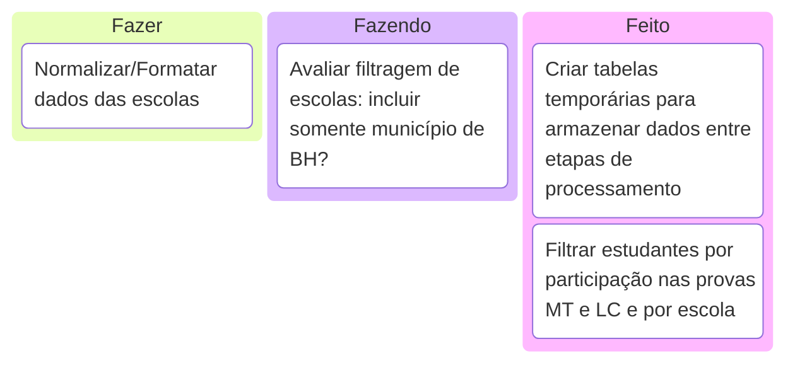

# Mineração de Microdados do ENEM para Identificação de Escolas com Bom Desempenho em TIC em Contextos Socioeconômicos Desfavoráveis
> Felipe Lacerda Tertuliano

## Sobre

Este trabalho propõe o desenvolvimento de um mecanismo analítico para identificar escolas da rede pública de ensino básico como alvo para intervenções em capacitação em Tecnologias da Informação e Comunicação (TIC). Utilizando microdados do ENEM e do Censo Escolar, a metodologia envolve a análise de dados em larga escala, cruzando o desempenho dos estudantes no exame nacional com indicadores socioeconômicos e características das escolas. O objetivo é identificar instituições com desempenho que fogem ao esperado para direcionar políticas públicas e recursos de forma mais eficaz, resultando em um protótipo, como scripts reprodutíveis ou um painel de indicadores, contribuindo para a ciência de dados aplicada, à educação e a formação em TIC no Brasil.

## Metodologia

No desenvolvimento desse projeto foi utilizado o processo _Knowledge Discovery in Databases_ (KDD) com o objetivo de transformar os dados em informação, conhecimento e assim finalmente em ação. Para isso a metodologia é dividida em 5 etapas cada uma com um conjunto de técnicas (não limitadas às) que estão aqui descritas:

```mermaid
flowchart LR
    D1@{ shape: cyl, label: "Dados" }
    P1@{ shape: rect, label: "#1 Seleção" }
    D2@{ shape: lin-cyl, label: "Dados\nSelecionados" }
    P2@{ shape: rect, label: "#2 Pre-processamento" }
    D3@{ shape: docs, label: "Dados\nPre-processados" }
    P3@{ shape: rect, label: "#3 Transformação" }
    D4@{ shape: docs, label: "Dados\nTransformados" }
    P4@{ shape: rect, label: "#4 Mineração" }
    D5@{ shape: doc, label: "Padrões" }
    P5@{ shape: rect, label: "#5 Interpretação" }
    D6@{ shape: tri, label: "Conhecimentos" }

    D1 --> P1 --> D2 --> P2 --> D3 --> P3 --> D4 --> P4 --> D5 --> P5 --> D6

    classDef p fill:#7BA7D0,stroke:#4A7AA9,color:#1a1a1a,stroke-width:1px
    classDef d1 fill:#D98F8F,stroke:#B56565,color:#1a1a1a,stroke-width:1px
    classDef d2 fill:#CD9F7A,stroke:#A87D5A,color:#1a1a1a,stroke-width:1px
    classDef d3 fill:#BDB06F,stroke:#978D4F,color:#1a1a1a,stroke-width:1px
    classDef d4 fill:#A4BA6B,stroke:#7E944B,color:#1a1a1a,stroke-width:1px
    classDef d5 fill:#8DC07A,stroke:#6A9657,color:#1a1a1a,stroke-width:1px
    classDef d6 fill:#7CC08C,stroke:#559662,color:#1a1a1a,stroke-width:1px

    class P1,P2,P3,P4,P5 p
    class D1 d1
    class D2 d2
    class D3 d3
    class D4 d4
    class D5 d5
    class D6 d6
```


> Diagrama baseado no modelo de _[Fayyad, U., Piatetsky-Shapiro, G., & Smyth, P. (1996). From data mining to knowledge discovery in databases. AI Magazine, 17(3)]_

### #1 Seleção

- Seleção de dados relevantes

### #2 Pre-processamento

- Formatação
- Normalização
- Remoção de ruídos

### #3 Transformação

- Agregação
- Geração de campos derivados
- Redução de dimensionalidade

### #4 Mineração

- _Clustering_
- Classificação
- Associação
- Detecção de _outliers_

### #5 Interpretação

- Diagramas
- Tabelas

## Cronograma

Para melhor acompanhamento e execução do trabalho desenvolvido foi utilizado as metodologias _Scrum_ e _Kanban_, onde cada _sprints_ é associada a uma etapa do processo KDD.


> Cronograma de _Sprints_ baseado na metodologia _Scrum_ (10/06/2026, sujeito a alterações)

Para cada novo inicio de _sprint_ é avaliado o que foi desenvolvido na etapa anterior e criado um novo _backlog_ (lista de tarefas) que serão executadas durante o período estimado. Atualmente (10/06/2026) o projeto se encontra na **Sprint de Pre-processamento** com as seguintes tarefas sendo desenvolvidas:


> Tabela baseada na metodologia _Kanban_ (10/06/2026, sujeito a alterações)

## Artigo

O artigo desenvolvido por esse projeto pode ser encontrado em [article](article), e seu PDF em [article/main.pdf](article/main.pdf)

## Código

Para executar o código nesse projeto é necessário ter instalado em sua máquina o `cargo` que pode ser baixado por [aqui](https://doc.rust-lang.org/cargo/getting-started/installation.html). Após a instalação sua execução é feita a partir do terminal na pasta raiz do projeto à partir do seguinte comando:

```bash
cargo run
```
